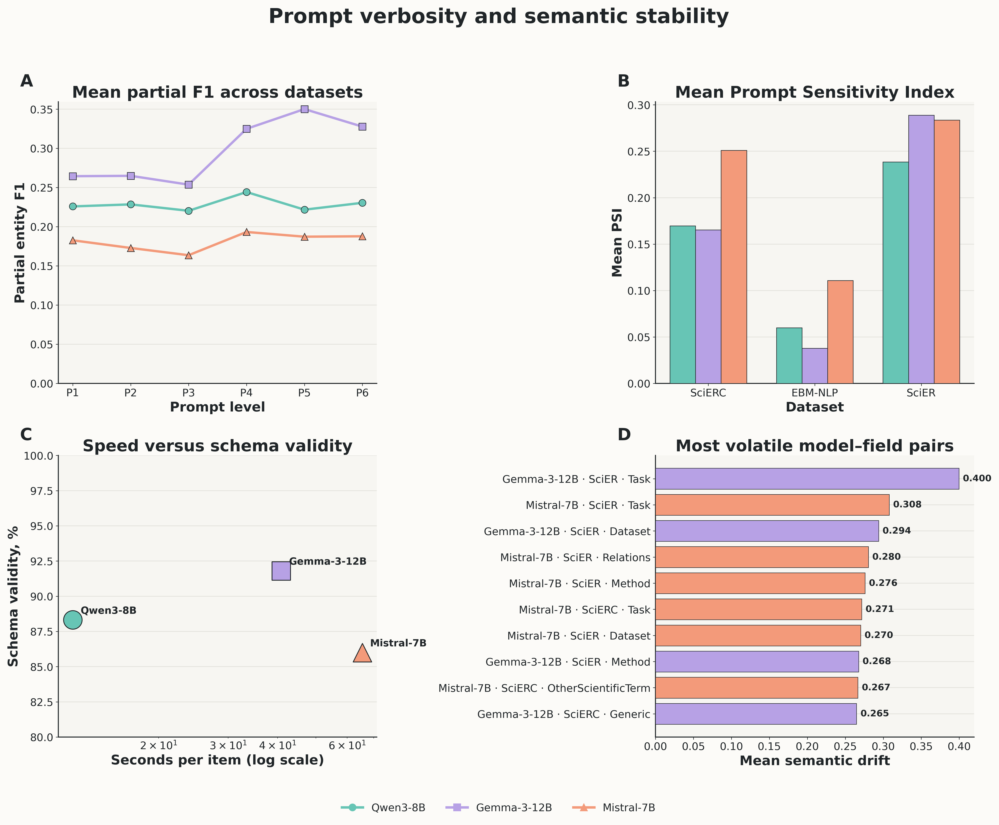
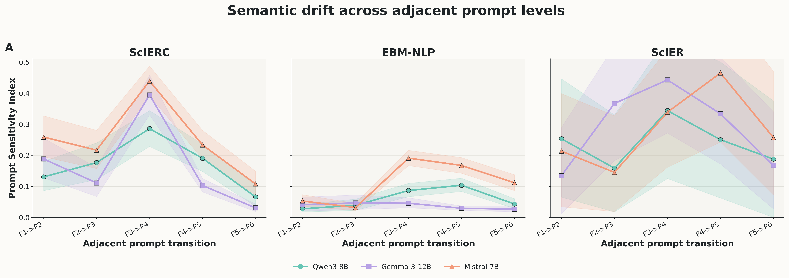
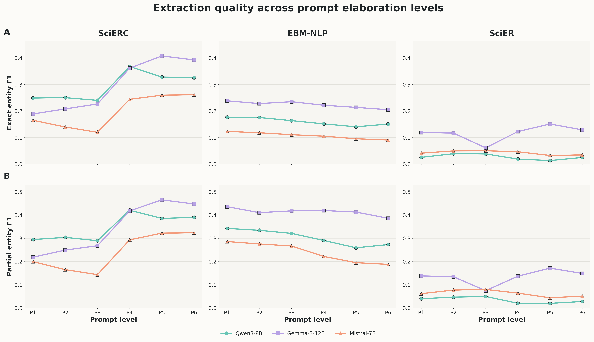
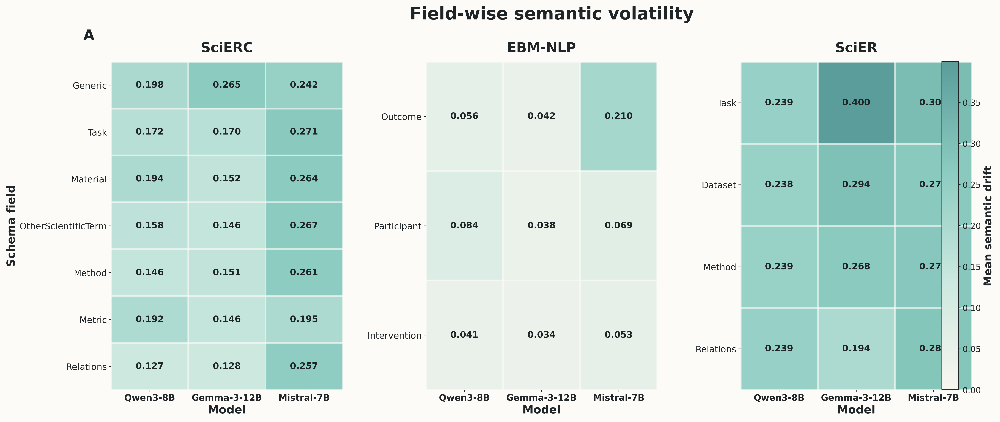
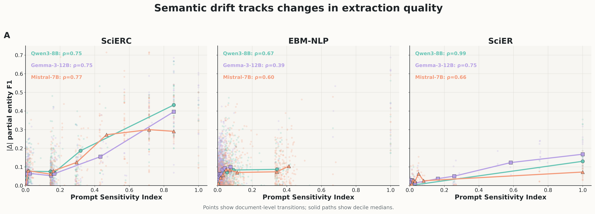
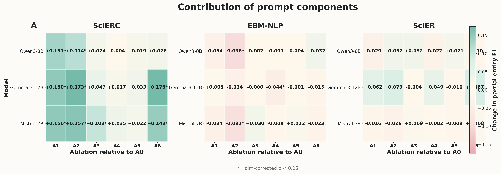

# PromptStressLab

**Controlled evaluation of prompt verbosity, semantic stability, and structured information extraction across local large language models.**

[](https://www.python.org/)


PromptStressLab studies how prompt elaboration affects schema-guided information extraction. The benchmark compares six prompt levels across three scientific extraction datasets and three instruction-tuned language models under fixed decoding settings.

The repository contains the full experimental pipeline, prompt configurations, manifests, evaluation code, statistical analyses, execution logs, generated predictions, and publication-ready figures. Raw datasets, local model weights, virtual environments, and caches are intentionally excluded.

<p align="center">
  
</p>

---

## Overview

Longer prompts may include additional definitions, formatting rules, demonstrations, constraints, negative instructions, and repeated guidance. These components can affect output quality and stability independently of prompt length.

PromptStressLab evaluates:

* extraction accuracy;
* hallucination behavior;
* JSON and schema validity;
* prompt and output token usage;
* generation latency;
* semantic drift between adjacent prompt levels;
* field-specific output volatility;
* instruction dropout;
* contributions of individual prompt components.

The study treats semantic stability as a property distinct from correctness. A stable output may remain consistently wrong, while an unstable output may occasionally become more accurate.

---

## Main findings

* No prompt level performs consistently best across all models and datasets.
* Demonstrations produce substantial gains on SciERC but can reduce extraction quality on EBM-NLP.
* Longer prompts increase input cost without consistent accuracy gains.
* Semantic drift is strongly associated with the absolute change in extraction F1.
* Mistral-7B exhibits higher semantic instability than Gemma-3-12B and Qwen3-8B on EBM-NLP and SciERC.
* SciER produces the highest field-wise volatility for all three models.
* Prompt composition has a stronger and more consistent effect than prompt length alone.

Across all datasets, the Spearman correlation between PSI and absolute partial-F1 change is:

| Model       | Spearman ρ |
| ----------- | ---------: |
| Qwen3-8B    |      0.723 |
| Mistral-7B  |      0.670 |
| Gemma-3-12B |      0.534 |

All three correlations remain significant after Holm correction.

---

## Models

The complete experiment uses three locally hosted instruction-tuned models:

| Identifier                | Model                    |
| ------------------------- | ------------------------ |
| `qwen3_8b`                | Qwen3-8B                 |
| `gemma_3_12b_it`          | Gemma-3-12B-IT           |
| `mistral_7b_instruct_v03` | Mistral-7B-Instruct-v0.3 |

The tested implementation disables thinking mode for Qwen3 and runs all models under the same decoding configuration.

### Structural validity and runtime

| Model                    | JSON valid | Schema valid | Mean time per item |
| ------------------------ | ---------: | -----------: | -----------------: |
| Gemma-3-12B-IT           |       100% |    **91.8%** |            40.87 s |
| Qwen3-8B                 |       100% |        88.3% |        **12.14 s** |
| Mistral-7B-Instruct-v0.3 |       100% |        86.0% |            65.59 s |

Runtime values describe the tested A100 execution setup and should not be interpreted as hardware-independent model benchmarks. Mistral execution included partial CPU offloading.

---

## Datasets

The benchmark covers three structured extraction settings:

| Dataset   | Main documents | Ablation documents | Task                                      |
| --------- | -------------: | -----------------: | ----------------------------------------- |
| SciERC    |            100 |                100 | Scientific entities and relations         |
| EBM-NLP   |            191 |                 84 | Participants, interventions, and outcomes |
| SciER     |             16 |                 16 | Scientific entities and relations         |
| **Total** |        **307** |            **200** | —                                         |

Expected normalized dataset locations:

```text
data/normalized/
├── scierc/
├── ebm_nlp/
└── scier/
```

Raw datasets are not distributed in this repository. Their original licenses and redistribution conditions remain applicable.

---

## Prompt conditions

### Main prompt ladder

Each main document is evaluated with six increasingly elaborate prompts:

```text
P1 → P2 → P3 → P4 → P5 → P6
```

The levels range from minimal schema instructions to prompts containing additional definitions, formatting guidance, demonstrations, constraints, negative instructions, and redundancy.

Exact prompt templates and condition definitions are stored in:

```text
config/experiment.json
```

### Component ablations

A separate ablation experiment evaluates seven conditions:

```text
A0, A1, A2, A3, A4, A5, A6
```

`A0` and `A1` reuse existing main-prompt generations:

```text
A0 = P3
A1 = P4
```

The remaining five conditions isolate selected prompt components. Reusing identical generations avoids unnecessary model calls and ensures exact comparability.

---

## Experiment scale

| Component                      |     Count |
| ------------------------------ | --------: |
| Main generations               |     5,526 |
| New ablation generations       |     3,000 |
| Physical model generations     | **8,526** |
| Reused alias rows              |     1,200 |
| Logical evaluation rows        | **9,726** |
| Physical generations per model |     2,842 |

The physical generation count is:

```text
3 models × (307 documents × 6 main prompts + 200 documents × 5 new ablations)
= 8,526
```

All expected generations completed successfully:

```text
Physical predictions: 8,526 / 8,526
Completion:           100%
Unresolved errors:    0
```

---

## Metrics

### Extraction quality

* exact entity F1;
* partial entity F1;
* relation F1;
* hallucination rate;
* completeness and null-output behavior.

### Structural reliability

* JSON validity;
* schema validity;
* Instruction Dropout Rate;
* truncation frequency.

### Efficiency

* prompt tokens;
* generated tokens;
* generation latency.

### Prompt Sensitivity Index

PSI measures semantic drift between outputs produced for adjacent prompt levels.

For each schema field:

```text
field drift = 1 − cosine(field representation at Pi,
                         field representation at Pi+1)
```

Special cases are defined as:

```text
empty → empty       = 0
empty → non-empty   = 1
non-empty → empty   = 1
```

Document-level PSI is the mean drift across the fields defined for the corresponding dataset.

The released analysis uses the CLIP ViT-B/32 text encoder and normalized centroids of extracted field items.

### Field-wise volatility

Field-wise volatility applies the same semantic-drift calculation separately to entity categories and relation fields. It identifies schema elements whose predictions are particularly sensitive to prompt formulation.

### Statistical analysis

The pipeline includes:

* paired Wilcoxon signed-rank tests;
* Holm multiple-testing correction;
* rank-biserial effect sizes;
* McNemar tests;
* Spearman correlations;
* bootstrap confidence intervals;
* IDR summaries;
* prompt-transition and component-ablation comparisons.

---

## Semantic stability results

Mean PSI across adjacent prompt transitions:

| Model                    |   EBM-NLP |    SciERC |     SciER |
| ------------------------ | --------: | --------: | --------: |
| Gemma-3-12B-IT           | **0.038** | **0.165** |     0.289 |
| Qwen3-8B                 |     0.060 |     0.170 | **0.239** |
| Mistral-7B-Instruct-v0.3 |     0.111 |     0.251 |     0.284 |

Lower values indicate greater semantic stability.

SciER has only 16 evaluation documents, so its estimates have wider confidence intervals and should be interpreted as a long-document stress test rather than a large benchmark.

<p align="center">
  
</p>

---

## Repository structure

```text
PromptStressLab/
├── config/
│   └── experiment.json
│
├── manifests/
│   └── experiment_jobs.jsonl
│
├── scripts/
│   ├── psl_common.py
│   ├── build_manifests_v2.py
│   ├── repair_ebm_manifest.py
│   ├── normalize_gold_datasets.py
│   ├── build_experiment_manifest.py
│   ├── run_model_experiment.py
│   ├── gpu_scheduler.py
│   ├── smart_gpu_scheduler.py
│   ├── evaluate_experiment.py
│   ├── collect_statistics.py
│   ├── compute_psi_volatility.py
│   ├── make_final_figures.py
│   └── status.py
│
├── logs/
│   ├── experiments/
│   ├── collect_statistics_final.log
│   ├── compute_psi_volatility.log
│   └── make_final_figures.log
│
├── outputs/
│   ├── generations/
│   ├── metrics/
│   ├── statistics/
│   └── figures_final/
│
└── .gitignore
```

Large datasets, checkpoints, local models, environments, and caches are excluded through `.gitignore`.

---

## Installation

Clone the repository:

```bash
git clone https://github.com/cataug/PromptStressLab.git
cd PromptStressLab
```

Create a virtual environment:

```bash
python3 -m venv .venv
source .venv/bin/activate
```

Install general analysis and inference dependencies:

```bash
pip install \
    numpy \
    pandas \
    scipy \
    scikit-learn \
    matplotlib \
    transformers \
    accelerate \
    sentencepiece \
    protobuf
```

Install PyTorch separately for the required CPU or CUDA platform.

The complete experiment was tested with:

```text
PyTorch:      2.6.0+cu124
Transformers: 5.12.0
Accelerate:   1.14.0
GPU:          NVIDIA A100-PCIE-40GB
```

---

## Configuration

Before running model inference:

1. Place normalized datasets under `data/normalized/`.
2. Download the required models locally.
3. Set dataset and model paths in `config/experiment.json`.
4. Confirm that each model can be loaded in the selected environment.

For offline Hugging Face execution:

```bash
export HF_HUB_OFFLINE=1
export TRANSFORMERS_OFFLINE=1
export TOKENIZERS_PARALLELISM=false
export PYTORCH_CUDA_ALLOC_CONF=expandable_segments:True
```

---

## Running the experiment

### 1. Build the experiment manifest

```bash
python scripts/build_experiment_manifest.py \
    --root "$PWD"
```

Expected physical job count:

```text
8,526
```

### 2. Inspect the planned workload

```bash
python scripts/status.py \
    --root "$PWD"
```

### 3. Run model inference

```bash
python scripts/smart_gpu_scheduler.py \
    --root "$PWD"
```

The smart scheduler executes the models sequentially, records live progress, handles model-specific memory constraints, and preserves completed predictions when restarted.

Predictions are written to:

```text
outputs/generations/<model_id>/predictions.jsonl
```

Errors are written to:

```text
outputs/generations/<model_id>/errors.jsonl
```

An old error entry is not treated as unresolved when a successful prediction for the same job exists.

---

## Evaluation and statistical analysis

### Compute extraction metrics

```bash
python scripts/evaluate_experiment.py \
    --root "$PWD"
```

### Compute aggregate statistics and significance tests

```bash
python scripts/collect_statistics.py \
    --root "$PWD"
```

### Compute PSI and field-wise volatility

A local CLIP text encoder is required:

```bash
python scripts/compute_psi_volatility.py \
    --root "$PWD" \
    --embedding-model "/path/to/clip_vit_base_patch32" \
    --device auto \
    --batch-size 512 \
    --bootstrap-iterations 5000
```

Expected output:

```text
Document transition pairs: 4,605 / 4,605
Field transition pairs:   20,055 / 20,055
Complete:                  true
```

### Generate publication-ready figures

```bash
python scripts/make_final_figures.py \
    --root "$PWD"
```

Figures are exported as both vector PDF and 300-dpi PNG files.

---

## Reusing the released predictions

A complete model rerun is not required to reproduce the evaluation, statistics, PSI analysis, or figures.

Using the released prediction files:

```bash
python scripts/evaluate_experiment.py \
    --root "$PWD"

python scripts/collect_statistics.py \
    --root "$PWD"

python scripts/compute_psi_volatility.py \
    --root "$PWD" \
    --embedding-model "/path/to/clip_vit_base_patch32"

python scripts/make_final_figures.py \
    --root "$PWD"
```

This reconstructs the derived metrics and visualizations from the saved model outputs.

---

## Main output files

### Evaluation

```text
outputs/metrics/
├── job_metrics_physical.csv
├── job_metrics_with_aliases.csv
├── aggregate_metrics.csv
├── aggregate_metrics_global.csv
└── evaluation_summary.json
```

### Statistical analysis

```text
outputs/statistics/
├── progress_by_model.csv
├── condition_summary.csv
├── paired_wilcoxon_tests.csv
├── mcnemar_tests.csv
├── idr_summary.csv
├── statistics_summary.json
├── psi_pairwise.csv
├── psi_summary.csv
├── psi_summary_overall.csv
├── field_volatility_pairwise.csv
├── field_volatility_summary.csv
├── field_volatility_summary_overall.csv
├── document_volatility.csv
├── psi_f1_correlations.csv
└── semantic_statistics_summary.json
```

### Figures

```text
outputs/figures_final/
├── fig01_f1_prompt_trajectories.pdf
├── fig02_psi_prompt_transitions.pdf
├── fig03_cost_quality_pareto.pdf
├── fig04_field_volatility_heatmaps.pdf
├── fig05_psi_f1_relationship.pdf
├── fig06_ablation_effects.pdf
├── fig07_speed_schema_validity.pdf
└── fig08_overview_poster.pdf
```

Equivalent PNG versions are provided for each figure.

---

## Figures

### Extraction quality across prompt levels

<p align="center">
  
</p>

### Field-wise semantic volatility

<p align="center">
  
</p>

### PSI and extraction-quality variation

<p align="center">
  
</p>

### Prompt-component ablations

<p align="center">
  
</p>

---

## Interpretation notes

* PSI measures sensitivity to prompt changes, not factual correctness.
* JSON validity only verifies syntactic parseability; schema validity applies additional structural checks.
* Relation F1 should be reported as not applicable when both predictions and references contain no evaluated relations, rather than interpreted as perfect extraction.
* Latency depends on hardware, batching, quantization, memory pressure, and CPU offloading.
* A0 and A1 are aliases of existing generations and are not additional model calls.
* SciER results have lower statistical power because the public evaluation subset contains 16 documents.
* Dataset-level differences should not be attributed only to prompt verbosity because schemas, document lengths, label distributions, and task complexity also differ.

---

## Reproducibility status

* [x] Prompt configurations released
* [x] Experiment manifest released
* [x] Model-generation scripts released
* [x] Evaluation implementation released
* [x] Statistical tests released
* [x] PSI and volatility implementation released
* [x] Execution logs released
* [x] Prediction outputs released
* [x] Publication-ready figures released
* [x] All 8,526 physical generations completed
* [x] No unresolved generation errors
* [ ] Raw datasets redistributed
* [ ] Local model weights redistributed

Dataset and model binaries are omitted because of size and licensing constraints.

---

## Citation

A formal citation will be added when the revised manuscript is released.

Until then, please reference the repository:

```text
PromptStressLab: Prompt Verbosity and Semantic Stability
in Structured LLM Extraction.
https://github.com/cataug/PromptStressLab
```

---

## Contact

Repository maintained by [@cataug](https://github.com/cataug).

Questions, bug reports, and reproducibility issues can be submitted through the repository issue tracker.
